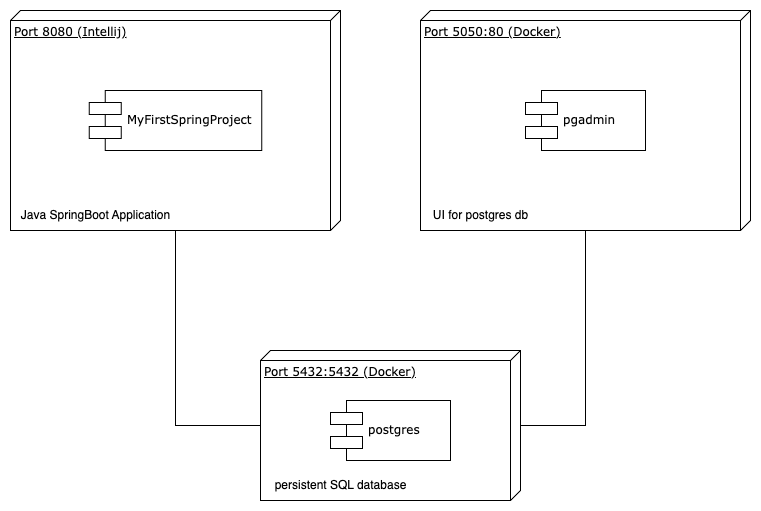

# -WebProgramming---MyFirstSpringProject

## Context:
This is my first spring boot project for learning spring boot. It is a monolithic application.  
Referenced from: https://www.youtube.com/watch?v=BLlEgtp2_i8

## Architecture Diagram

## Setup Instructions

### Docker compose:
- For using the docker-compose.yml for complete setup:
`docker compose up -d`

### Individual container setup:
- For generating docker image for the using Maven  
`./mvnw spring-boot:build-image "-Dspring-boot.build-image.imageName=<image name>"`

- For login into docker using access token  
`docker login  -u <docker username> <docker access token>`

- For pushing the docker image to docker hub (so that others can pull it and run in a container)  
`docker push <docker username>/<image name>`

- For running the image and map port 8080 of container to 8080 of device  
`docker run -p8080:8080 <docker username>/<image name>`

- Create network  
`docker network create my-network`

- For setting up Postgres container  
`docker run -d --name db --network my-network -e POSTGRES_PASSWORD=<postgres password> postgres`

- For setting up pgadmin container (will pull pgadmin4 image if not present in local device)  
`docker run -d --name pgadmin --network my-network -e PGADMIN_DEFAULT_EMAIL=admin@admin.com -e PGADMIN_DEFAULT_PASSWORD=<pg admin password> dpage/pgadmin4`

- For testing the connection between pgadmin container & db container  
`docker exec -it pgadmin ping db`